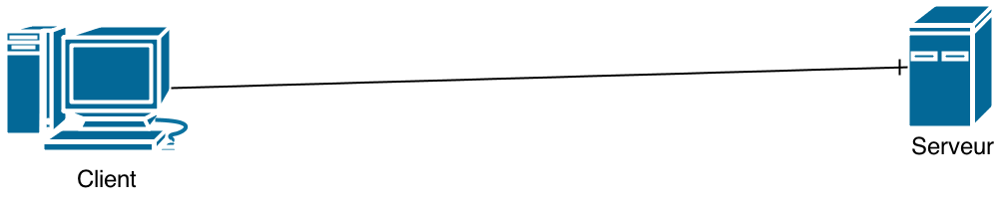

# Tha interwebz

---

# Il y a beaucoup

- Fonctionnement des réseaux
- Protocole HTTP
- HTML
- CSS
- JS

Ce talk sera une introduction qui vous permetrra de vous débrouiller et d'apprendre par vous même

---

# Définitions

---
# Web ≠ Internet
Internet :

- mails
- ssh
- jeux en ligne
- <strike>Skype</strike> Mumble
- web

---

# Web ≠ Internet

Web :

- HTTP
- URI (ex : https://wiki.urlab.be/Main_Page)
- HTML
- CSS
- JS
- ...

---

# Comment ça marche ?

Pour faire du web, on a besoin de :

- Un client (le navigateur)
- Un serveur
- Un truc qui relie les deux

---

# Browsers

Navigateur = Browser = Client

---

# Serveur

Une machine quelque part sur internet

---

# Serveur

---

# Serveur

---

# Un truc qui relie les deux

Une connexion entre le client et le serveur :

En gros, c'est un tuyau entre les deux et du texte qui passe dedans.

---

# HTTP

Système de question - réponse

# Question

    Salut, example.com, j'aimerais ta page index.html

# Réponse

    J'ai bien cette page là sur mon disque, elle
    fait 53 caractères. Là voila :

    <html>Je suis le contenu de la page index.html</html>
---

# HTTP en vrai
# Question
    GET /index.html HTTP/1.1
    host: example.com

(terminée par deux retours à la ligne)

---

# HTTP en vrai
# Réponse
    HTTP/1.1 200 OK
    Date: Mon, 18 Apr 2042 16:38:00 GMT
    Server: Apache/1.3.27 (Unix)
    Last-Modified: Thu, 01 Jul 2004 01:16:05 GMT
    Content-Length: 6188
    Connection: close
    Content-Type: text/html

    <html>
        <head>
        <title>
    [contenu de la page en elle même ici]

---

# URI

Une manière d'identifier quelque chose, quelque part sur internet.

    http://wiki.urlab.be/Evenement:SmartMonday_6

Je veux parler en `http` à `wiki.urlab.be` et lui demander la page `Evenement:SmartMonday_6`

Ce n'est pas limité au web. Une URI peut identifier un canal irc aussi :

    irc://irc.freenode.net/urlab

---

# Une vraie page web

    HTTP/1.1 200 OK
    Date: Mon, 18 Apr 2042 16:38:00 GMT
    Server: Apache/1.3.27 (Unix)
    Last-Modified: Thu, 01 Jul 2004 01:16:05 GMT
    Content-Length: 6188
    Connection: close
    Content-Type: text/html

    <html>
        <head>
        <title>
    [contenu de la page en elle même ici]

---

# Une vraie page web

    Content-Type: text/html

Le browser sait que c'est du html et va l'interpéter comme tel

---

# Exemple
    !html
    <html>
        <head>
            <title>Tha interwebz</title>
        </head>
        <body>
            
Je suis du texte

        </body>
    </html>

---

# Des balises

    !html
    <balise>
        Contenu de balise
    </balise>
---

# Des balises
## Toujours fermées
C'est comme des parenthèses, il faut les fermer

    !html
    <balise>
        Contenu de balise
---
# Des balises
## Qui s'imbriquent
C'est comme des parenthèses, on peut les imbriquer

    !html
    <balise>
        <balise>
            Contenu de balise
        </balise>
    </balise>
---
# Des balises
## Qui s'imbriquent dans d'autres balises
C'est comme des parenthèses, et les crochets ont peut les imbriquer

    !html
    <balise>
        <autrebalise>
            Contenu de balise
        </autrebalise>
    </balise>
---
# Des balises
## Qu'il faut fermer dans le bon ordre
Encore une fois, c'est comme des parenthèses...

    !html
    <balise>
        <autrebalise>
            Contenu de balise
         </balise>
    </autrebalise>
 Equivaut à

    (a*[b+c)+d]
---

# Des attibuts

    !html
    <balise attribut="valeur">
        <autrebalise color="red">
            <encoreuneautre randomattribute="random val" >
                Contenu de balise
            </encoreuneautre>
         </balise>
    </autrebalise>

- Uniqement sur les balises ouvrantes
- Certains sont interprétés par le browser

---

# Des arbres

    !html
    <html>
    <body>
    <table>
       <tr>
          <td colspan="2"></td>
       </tr>
       <tr>
          <td>
             Welcome to my sample HTML page!
              
             <a href="somelink.html" id="myLink" >Click Here!</a>
          </td>
          <td></td>
       </tr>
    </table>
    </body>
    </html>
---

# Des arbres

---

# Ouais mais je fais comment moi ?

---
# Squelette
    !html
    <!DOCTYPE html>
    <html>
        <head>
            <meta charset=utf-8 />
            <title>Un titre</title>
        </head>
        <body>
            Mettez tout votre contenu ici
        </body>
    </html>
---
# `<html>`
## `<head>`
Des infos utiles à votre page mais jamais en tant que tel
## `<body>`
Le vrai contenu

---

# Balises utiles

- `p`
- `table`, `td`, `tr`
- `a`
- `ul`, `li`
- `img`
- `br`
- `hx`

---

# CSS
---
# CSS
Mettre du style dans vos pages

    !html
    
Texte

## Règles

    !css
    color: red;
---
# Construction d'une règle
- une propriété
- `:`
- une valeur
- `;` (si ce n'est pas la dernière règle)

---

# Exemple

    !html
    
Texte

---

# Propriétés

- `color`
- `border`
- `height`, `width`
- `margin`, `padding`
- `background-color`
- `font-size`

---

# Comment faire pour colorier 2 `
` de la même manière ?

    !html
    
Texte

    
Autre texte

---

# Comment faire pour colorier 2 `
` de la même manière ?
## On sort le CSS de `style`

    !css
    p {
        color: red;
        font-size: 10px;
    }

---

# Ca marche comment ?

    !css
    un-selecteur {
        des regles
    }
---

# Sélecteurs
# La base
    !css
    p { color: red; }

    .classe { color: red; }

    #id { color: red; }
---
#Sélecteurs
# Class
    !html
    
Texte

    
Autre exte

    <a class="plop" href="/">Home</a>
Utilisable autant de fois que l'on veut

---
#Sélecteurs
# Id
    !html
    
Texte

Ne peut-être utilisé qu'une seule fois par page

---

# Sélecteurs
    !css
    a, p {} // tous les <a> et tous les 

    p a {} // tous les <a> qui sont
           // des descendants d un 

    p > a {} // tous les <a> qui sont
             // des enfants directs d un 

    h1 + p {} // tous les p qui sont
              // frères immédiats d'un h1
    h1#titre {} // le <h1> qui a un id="titre"
    p.foo {} // tous les 
 qui ont class="foo"

----

# Sélecteurs
## Combinons
    !css
    h1#titre > p.foo {} // Samarche ® aussi

---

# Y'en a d'autres
## Pseudo-classes
    !css
    a:link    { color: red }    /* <a> pas encore visités */
    a:visited { color: blue }   /* <a> visités   */
    a:hover   { color: yellow } /* <a> survolés    */
    a:active  { color: lime }   /* <a> actifs    */

## Et encore d'autres :

 `http://www.w3.org/TR/CSS2/selector.html`

---

# MOAR pseudo-classes !
    !css
    tr:nth-child(2n+1) /* represents every odd row of an HTML table */
    tr:nth-child(odd)  /* same */
    tr:nth-child(2n+0) /* represents every even row of an HTML table */
    tr:nth-child(even) /* same */

    /* Alternate paragraph colours in CSS */
    p:nth-child(4n+1) { color: navy; }
    p:nth-child(4n+2) { color: green; }
    p:nth-child(4n+3) { color: maroon; }
    p:nth-child(4n+4) { color: purple; }

http://www.w3.org/TR/css3-selectors/

---

# Comment faire pour colorier 2 `
` de la même manière ?
## On sort le CSS de `style`

    !css
    p {
        color: red;
        font-size: 10px;
    }
Mais il va ou alors ?

---

# Mais il va ou alors ?
    !html
    <!DOCTYPE html>
    <html>
        <head>
            <meta charset="utf-8" />
            
            <title>Titre</title>
        </head>
        <body>
            
Texte

            
Texte 2

        </body>
    </html>

---

# Mais il va ou alors ?
    !html
    <!DOCTYPE html>
    <html>
        <head>
            <meta charset="utf-8" />
            <link rel="stylesheet" href="style.css" />
            <title>Titre</title>
        </head>
        <body>
            
Texte

            
Texte 2

        </body>
    </html>

---

# La suite

---

# Le dynamisme
# Côté serveur
Le serveur renvoie du html. Comment s'arranger pour qu'il soit différent ?

- en fonction du moment
- de la personne
- de la météo ?

---

# Le dynamisme
# Côté serveur
Python (avec Django, web.py, flask), PHP, whatever

---

# Le dynamisme
# Côté client
Le html est chargé par le browser mais l'utilisateur peut faire des événements

- cliquer quelque part
- faire bouger sa souris
- appuyer sur une touche

----

# Le dynamisme
# Côté client

Comment faire pour changer la page côté client ?

- rajouter une règle css
- faire clignoter quelque chose
- ...

Le tout, sans devoir reparler au serveur

---

# Le dynamisme
# Côté client

JS

---

# Balises et sélecteurs

- Html : http://fr.openclassrooms.com/informatique/cours/apprenez-a-creer-votre-site-web-avec-html5-et-css3/memento-1
- Css : http://fr.openclassrooms.com/informatique/cours/apprenez-a-creer-votre-site-web-avec-html5-et-css3/memento-3
